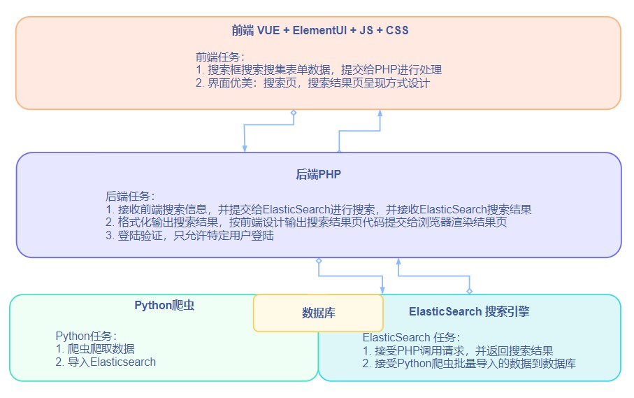

# 搜索网站设计记录
tags: Python爬虫, Elasticsearch, PHP, JS, Vue, ElementUI
<!-- toc -->


## 一、架构设计：



## 二、开发：技术研究与总结

### 1、Python 爬虫

- **模拟浏览器爬取网页数据：**

```python
import requests
kv = {'user-agent':'Chrome/10.0'} #或者‘Mozilla/5.0’
url = "http://www.google.com"
r = requests.get(url, headers = kv) # headers = kv 模拟Chrome浏览器
r.status_code #查看状态，200即表示已经成功抓取数据，其他数字是错误代码如：404
r.text #显示数据包内容（无格式）
```


- **对抓取的HTML数据，或本地HTML文件解析：**

```python
from bs4 import BeautifulSoup #引入BeautifulSoup库
soup = BeautifulSoup(data, 'html.parser') #data可以是"<p>Hello World!</p>"", 可以是r.text, 可以是 open("D://demo.html")
print(soup.prettiy()) #格式化输出
```


- **提取想要的信息：**

```python
content = soup.p.parent #提取信息

tagDiv = 'div.post-content' #第二种方法提取信息, 或者tagDiv = 'div.post-content p'其中的p标签
art = soup.select(tagDiv)

smalltilte = art.find_all('p', style="text-align: center;") # 在有用信息里提取关键信息，保存为list
for str in smalltilte:
    print(str)


```


- **保存信息为 JSON 文档：**

```python
for titles in smalltitle:
    data.append(titles.string) #遍历得到的有效数据，抓取其中的字符串，保存为list

from collections import defaultdict
dict0 = defaultdict(list) # list 转换为 dict 
for stitles in data:
    dict0["stitles"].append(stitles)

import json
dict0["url"].append(url)
print(dict0)
json_str = json.dumps(dict0, ensure_ascii=False) # 禁用默认编码：AscII,以输出中文内容
with open('test_data.json', 'w') as json_file: # json文件路径默认是C盘User根目录
    json_file.write(json_str)
```


- **清明网获取小标题的爬虫代码：**

```python
import re
import requests
import json
from bs4 import BeautifulSoup
from collections import defaultdict


url = 'http://www...'
kv = {'user-agent':'Chrome/10.0'}
data = []
output = open('data.txt', 'w+')


r = requests.get(url, headers = kv)
soup = BeautifulSoup(r.text, 'html.parser')
content = soup.p.parent
smalltitle = content.find_all('p', style="text-align: center;")


for titles in smalltitle:
    data.append(titles.string)


dict0 = defaultdict(list)
for stitles in data:
    dict0["stitles"].append(stitles)


dict0["url"].append(url)
print(dict0)
json_str = json.dumps(dict0, ensure_ascii=False)
with open('test_data.json', 'w') as json_file:
    json_file.write(json_str)
```


- **清明爬虫程序全代码备份**

```python
import re
import requests
import json
from bs4 import BeautifulSoup
from collections import defaultdict

def getURL(url, kv):
    r = requests.get(url, headers = kv)
    soup = BeautifulSoup(r.text, 'html.parser')
    content = soup.p.parent
    urls = content.find_all('a')
    links = []
    for link in urls:
        links.append(link.attrs['href'])
    return links

def getURL2(links, kv):
    sublinks = []
    for link in links:
        r = requests.get(link, headers = kv, timeout = 30)
        r.raise_for_status()
        soup = BeautifulSoup(r.text, 'html.parser')
        content = soup.p.parent
        urls = content.find_all('a')
        for link in urls:
            if link.string == "纲目":                         # 如果a标签里的内容是纲目，就把此标签的herf添加到sublinks列表
                sublinks.append(link.attrs['href'])
    return sublinks

def getTitles(urls, kv):
    mtitles = []
    for link in urls:
        r = requests.get(link, headers = kv, timeout = 30)
        r.raise_for_status()
        soup = BeautifulSoup(r.text, 'html.parser')
        titles = soup.find_all('h4')
        for title in titles:
            mtitles.append(title.string)
    return mtitles

def getStitles(urls, kv):
    stitles = []
    for link in urls:
        r = requests.get(link, headers = kv, timeout = 30)
        r.raise_for_status()
        soup = BeautifulSoup(r.text, 'html.parser')
        content = soup.p.parent
        titles = content.find_all('p', style="text-align: center;")
        tpls1 = []
        tpls2 = []
        for title in titles:
            tpls1.append(title.string)
        tpls2 = "、".join(tpls1)
        stitles.append(tpls2)
    return stitles

def getOutlines(urls, kv):
    outlines = []
    dr = re.compile(r'<[^>]+>', re.S)
    for link in urls:
        r = requests.get(link, headers = kv, timeout = 30)
        r.raise_for_status()
        soup = BeautifulSoup(r.text, 'html.parser')
        excerpts = soup.find('p', string = '职事信息摘录：')
#        title = soup.title.string                              # 纠错机制，如果有错误，开启此处代码，定位篇题
#        outlines.append(title)
#        outlines.append(excerpts)
        outlinetags = excerpts.find_previous_siblings('p')
        tpls1 = []
        for outline in outlinetags:
            dd = dr.sub('', str(outline))
            tpls1.append(dd)
        str0 = "、".join(tpls1)
        outlines.append(str0)
    return outlines

def getExcerpts(urls, kv):
    outlines = []
    dr = re.compile(r'<[^>]+>', re.S)
    for link in urls:
        r = requests.get(link, headers = kv, timeout = 30)
        r.raise_for_status()
        soup = BeautifulSoup(r.text, 'html.parser')
        excerpts = soup.find('p', string = '职事信息摘录：')
#        title = soup.title.string                              # 纠错机制，如果有错误，开启此处代码，定位篇题
#        outlines.append(title)
#        outlines.append(excerpts)
        outlinetags = excerpts.find_next_siblings('p')
        tpls1 = []
        for outline in outlinetags:
            dd = dr.sub('', str(outline))
            tpls1.append(dd)
        str0 = "、".join(tpls1)
        outlines.append(str0)
    return outlines

def savetoJson(url, title, outlines, excerpts, subtitles): # 按Elasticsearch批量导入格式输出为JSON 
    ls1 = ['url', 'title', 'outline', 'excerpt', 'stitle']
    ls2 = url
    ls3 = title
    ls4 = outlines
    ls5 = excerpts
    ls6 = subtitles
    indexname = "pan"
    dl = []
    
    for i in range(0, len(ls2)):
        d = {}
        d[ls1[0]] = (ls2[i])
        d[ls1[1]] = (ls3[i])
        d[ls1[2]] = (ls4[i])
        d[ls1[3]] = (ls5[i])
        d[ls1[4]] = (ls6[i])
        d2 = {"index":{"_index":indexname, "_id":i}}
        dl.append(d2)
        dl.append(d)
        
    json_str = json.dumps(dl, ensure_ascii=False)
    with open('test_data.json', 'w') as json_file:
        json_file.write(json_str)   
    return

def main():
    url = "大分类链接"
    kv  = {'user-agent':'Chrome/10.0'}
    links = getURL(url, kv)           # 小分类的link列表
    outlinelinks = getURL2(links, kv) # 所有纲目的link列表
    msgtitles = getTitles(outlinelinks, kv) # 篇题
    msgstitles = getStitles(outlinelinks, kv) # 小标题
    msgoutlines = getOutlines(outlinelinks, kv) # 纲目
    msgexcerpts = getExcerpts(outlinelinks, kv) # 摘录
    savetoJson(outlinelinks, msgtitles, msgoutlines, msgexcerpts, msgstitles) # 格式化输出

# 问题排查与解决：
#    print('outlinelinkss_len: ' + str(len(outlinelinks)))
#    print('msgtitles_len: ' + str(len(msgtitles)))
#    print('msgstitles_len: ' + str(len(msgstitles)))
#    print('msgoutlines_len: ' + str(len(msgoutlines)))
#    print('msgexcerpts_len: ' + str(len(msgexcerpts)))
#    print('outlinelinkss_len: ' + str(len(outlinelinks)))
#    print(outlinelinks)
#    print(msgtitles)

main()
```


- [BeautifulSoup 中文文档](https://www.crummy.com/software/BeautifulSoup/bs4/doc.zh/)

### 2、Elasticsearch API

- **Python写入数据：**

> 安装：` $ python -m pip install elasticsearch`

```python
from elasticsearch import Elasticsearch
es = Elasticsearch()

doc = { # 吸入的内容格式
    'author': 'author_name',
    'text': 'Interensting content...'
}
res = es.index(index="test-index", id=1, body=doc) #写入
print(res['result'])

#结构：
Elasticsearch().index(index="test-index", id=1, body={"我是插入数据的key":"我是插入数据的Velue"})


```


- **PHP 调用 ES:**

```php+HTML
待更新....
```


- **批量导入数据：**

```
POST _bulk
{"index":{"_index":"index_name", "_id":id_num}}
{"url":"https://www.google.com", "stitles":["title1", "title2"]}

```

### 3、Vue：

待更新

### 4、Element-UI

待更新

### 5、JavaScript

待更新

### 6、PHP

待更新

### 7、正则表达式：

- **去掉string类里面的html标签：**

```python
# 规则：
content = re.compile(r'<[^>]+>', re.S).sub('', '<p>内容</p>')

# 用法：    
import re
html='<p style='font-size: 1em'>标题<strong>正文</strong></p>'
dr = re.compile(r'<[^>]+>', re.S)
dd = dr.sub('', html)
print(dd)
	标题正文
    
# 实例：
import re
import requests
from bs4 import BeautifulSoup

url='https://www.google.com'
r = requests.get(url)
soup = BeautifulSoup(r.text, 'html.parser')
html = soup.find_all('p')
dr = re.compile(r'<[^>]+>', re.S)
data = []
for content in html:
    dd = dr.sub('', str(content)) # (.sub 能处理string类，所以要先转换成string)
    data.append(dd)
print(data)
	'[© 2021 - Privacy - Terms]'

```

- **语法表：**

| 字符          | 释义                                                         |
| ------------- | ------------------------------------------------------------ |
| \             | 将下一字符标记为特殊字符、文本、反向引用或八进制转义符。例如，“n”匹配字符“n”。“\n”匹配换行符。序列“\\”匹配“\”，“\(”匹配“(”。 |
| ^             | 匹配输入字符串开始的位置。如果设置了 **RegExp** 对象的 **Multiline** 属性，^ 还会与“\n”或“\r”之后的位置匹配。 |
| $             | 匹配输入字符串结尾的位置。如果设置了 **RegExp** 对象的 **Multiline** 属性，$ 还会与“\n”或“\r”之前的位置匹配。 |
| *             | 零次或多次匹配前面的字符或子表达式。例如，zo* 匹配“z”和“zoo”。* 等效于 {0,}。 |
| +             | 一次或多次匹配前面的字符或子表达式。例如，“zo+”与“zo”和“zoo”匹配，但与“z”不匹配。+ 等效于 {1,}。 |
| ?             | 零次或一次匹配前面的字符或子表达式。例如，“do(es)?”匹配“do”或“does”中的“do”。? 等效于 {0,1}。 |
| {*n*}         | *n* 是非负整数。正好匹配 *n* 次。例如，“o{2}”与“Bob”中的“o”不匹配，但与“food”中的两个“o”匹配。 |
| {*n*,}        | *n* 是非负整数。至少匹配 *n* 次。例如，“o{2,}”不匹配“Bob”中的“o”，而匹配“foooood”中的所有 o。“o{1,}”等效于“o+”。“o{0,}”等效于“o*”。 |
| {*n*,*m*}     | *M* 和 *n* 是非负整数，其中 *n* <= *m*。匹配至少 *n* 次，至多 *m* 次。例如，“o{1,3}”匹配“fooooood”中的头三个 o。'o{0,1}' 等效于 'o?'。注意：您不能将空格插入逗号和数字之间。 |
| ?             | 当此字符紧随任何其他限定符（*、+、?、{*n*}、{*n*,}、{*n*,*m*}）之后时，匹配模式是“非贪心的”。“非贪心的”模式匹配搜索到的、尽可能短的字符串，而默认的“贪心的”模式匹配搜索到的、尽可能长的字符串。例如，在字符串“oooo”中，“o+?”只匹配单个“o”，而“o+”匹配所有“o”。 |
| .             | 匹配除“\n”之外的任何单个字符。若要匹配包括“\n”在内的任意字符，请使用诸如“[\s\S]”之类的模式。 |
| (*pattern*)   | 匹配 *pattern* 并捕获该匹配的子表达式。可以使用 **$0…$9** 属性从结果“匹配”集合中检索捕获的匹配。若要匹配括号字符 ( )，请使用“\(”或者“\)”。 |
| (?:*pattern*) | 匹配 *pattern* 但不捕获该匹配的子表达式，即它是一个非捕获匹配，不存储供以后使用的匹配。这对于用“or”字符 ('\竖杠') 组合模式部件的情况很有用。例如，'industr(?:y'\竖杠'ies) 是比 'industry'\竖杠'industries' 更经济的表达式。 |
| (?=*pattern*) | 执行正向预测先行搜索的子表达式，该表达式匹配处于匹配 *pattern* 的字符串的起始点的字符串。它是一个非捕获匹配，即不能捕获供以后使用的匹配。例如，'Windows (?=95'\竖杠'98'\竖杠'NT'\竖杠'2000)' 匹配“Windows 2000”中的“Windows”，但不匹配“Windows 3.1”中的“Windows”。预测先行不占用字符，即发生匹配后，下一匹配的搜索紧随上一匹配之后，而不是在组成预测先行的字符后。 |
| (?!*pattern*) | 执行反向预测先行搜索的子表达式，该表达式匹配不处于匹配 *pattern* 的字符串的起始点的搜索字符串。它是一个非捕获匹配，即不能捕获供以后使用的匹配。例如，'Windows (?!95'\竖杠'98'\竖杠'NT'\竖杠'2000)' 匹配“Windows 3.1”中的 “Windows”，但不匹配“Windows 2000”中的“Windows”。预测先行不占用字符，即发生匹配后，下一匹配的搜索紧随上一匹配之后，而不是在组成预测先行的字符后。 |
| *x*'\竖杠'*y*      | 匹配 *x* 或 *y*。例如，'z'\竖杠'food' 匹配“z”或“food”。'(z'\竖杠'f)ood' 匹配“zood”或“food”。 |
| [*xyz*]       | 字符集。匹配包含的任一字符。例如，“[abc]”匹配“plain”中的“a”。 |
| [^*xyz*]      | 反向字符集。匹配未包含的任何字符。例如，“[^abc]”匹配“plain”中的“p”。 |
| [*a-z*]       | 字符范围。匹配指定范围内的任何字符。例如，“[a-z]”匹配“a”到“z”范围内的任何小写字母。 |
| [^*a-z*]      | 反向范围字符。匹配不在指定的范围内的任何字符。例如，“[^a-z]”匹配任何不在“a”到“z”范围内的任何字符。 |
| \b            | 匹配一个字边界，即字与空格间的位置。例如，“er\b”匹配“never”中的“er”，但不匹配“verb”中的“er”。 |
| \B            | 非字边界匹配。“er\B”匹配“verb”中的“er”，但不匹配“never”中的“er”。 |
| \c*x*         | 匹配 *x* 指示的控制字符。例如，\cM 匹配 Control-M 或回车符。*x* 的值必须在 A-Z 或 a-z 之间。如果不是这样，则假定 c 就是“c”字符本身。 |
| \d            | 数字字符匹配。等效于 [0-9]。                                 |
| \D            | 非数字字符匹配。等效于 [^0-9]。                              |
| \f            | 换页符匹配。等效于 \x0c 和 \cL。                             |
| \n            | 换行符匹配。等效于 \x0a 和 \cJ。                             |
| \r            | 匹配一个回车符。等效于 \x0d 和 \cM。                         |
| \s            | 匹配任何空白字符，包括空格、制表符、换页符等。与 [ \f\n\r\t\v] 等效。 |
| \S            | 匹配任何非空白字符。与 [^ \f\n\r\t\v] 等效。                 |
| \t            | 制表符匹配。与 \x09 和 \cI 等效。                            |
| \v            | 垂直制表符匹配。与 \x0b 和 \cK 等效。                        |
| \w            | 匹配任何字类字符，包括下划线。与“[A-Za-z0-9_]”等效。         |
| \W            | 与任何非单词字符匹配。与“[^A-Za-z0-9_]”等效。                |
| \x*n*         | 匹配 *n*，此处的 *n* 是一个十六进制转义码。十六进制转义码必须正好是两位数长。例如，“\x41”匹配“A”。“\x041”与“\x04”&“1”等效。允许在正则表达式中使用 ASCII 代码。 |
| \*num*        | 匹配 *num*，此处的 *num* 是一个正整数。到捕获匹配的反向引用。例如，“(.)\1”匹配两个连续的相同字符。 |
| \*n*          | 标识一个八进制转义码或反向引用。如果 \*n* 前面至少有 *n* 个捕获子表达式，那么 *n* 是反向引用。否则，如果 *n* 是八进制数 (0-7)，那么 *n* 是八进制转义码。 |
| \*nm*         | 标识一个八进制转义码或反向引用。如果 \*nm* 前面至少有 *nm* 个捕获子表达式，那么 *nm* 是反向引用。如果 \*nm* 前面至少有 *n* 个捕获，则 *n* 是反向引用，后面跟有字符 *m*。如果两种前面的情况都不存在，则 \*nm* 匹配八进制值 *nm*，其中 *n* 和 *m* 是八进制数字 (0-7)。 |
| \nml          | 当 *n* 是八进制数 (0-3)，*m* 和 *l* 是八进制数 (0-7) 时，匹配八进制转义码 *nml*。 |
| \u*n*         | 匹配 *n*，其中 *n* 是以四位十六进制数表示的 Unicode 字符。例如，\u00A9 匹配版权符号 (?)。 |

## 三、上传与维护：

1. 购买服务器上传网站，调试配置服务器
2. 购买域名绑定服务器

## 四、Todo List

- [x] PHP、Python、JS、Vue、Elasticsearch开发环境配置
- [x] Elasticsearch批量导入方法
- [x] Python爬虫爬取清明数据
- [x] Python数据解析
- [x] Python数据提取
- [x] Python数据格式化输出
- [x] PHP 调用 Elasticsearch
- [x] PHP 接受ES搜索结果
- [x] PHP 转换搜索结果为网页代码，提交浏览器渲染
- [x] 分别查询、标题、小标题、等不同项目
- [x] 多类合并查询
- [x] 查询结果高亮、
- [x] 查询结果显示内容链接
- [x] Python按Elasticsearch批量导入代码格式，输出数据
- [x] Python爬取纲目、摘录
- [x] Python自动导入数据到Elasticsearch
- [ ] Vue + ElementUI 设计登陆页、查询页、搜索结果页
- [ ] PHP 登陆验证
- [ ] ES 中文分词器使用，并自定义本领域专用名词
- [ ] ES 模糊搜索技术应用
- [ ] 导入清明之外的其他数据，丰富查询范围

## 五、搜索功能

- [ ] 小标题搜索
- [ ] 纲目搜索
- [ ] 摘录搜索
- [ ] Tag搜索
- [ ] 模糊搜索
- [ ] 经文搜索